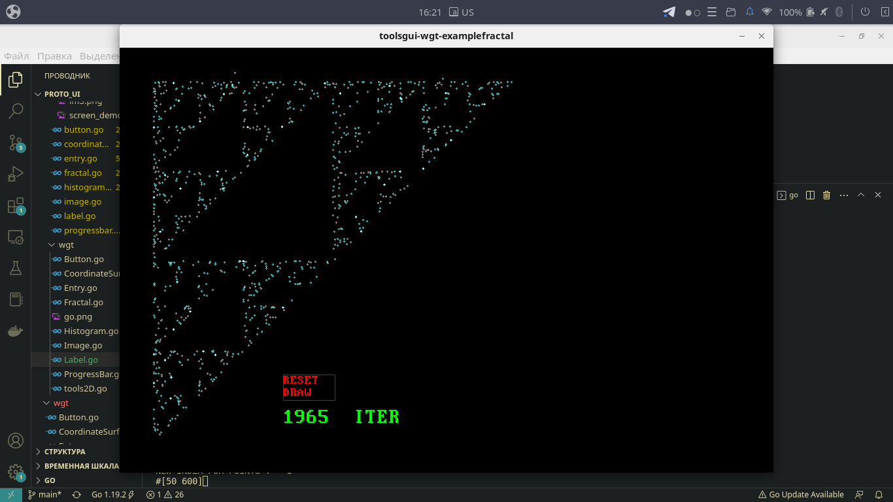

# fractal_go

> Requirements
```
go get github.com/YuranIgnatenko/proto_ui/toolsgui/wgt
go get github.com/gonutz/prototype/draw
```

> Install
```
git clone https://github.com/YuranIgnatenko/fractal_go.git
```

> Demo screen
> 
